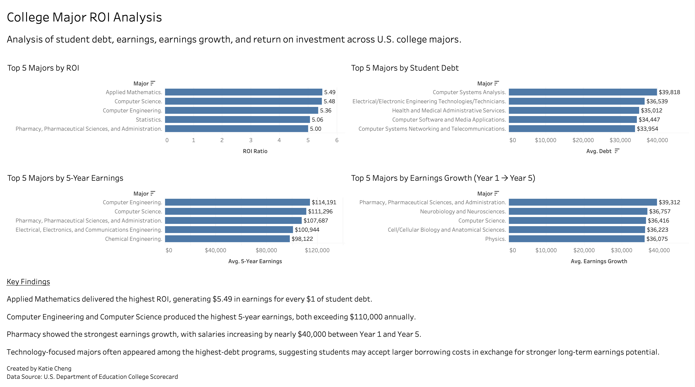

# college-roi-analysis
Analyzed U.S. College Scorecard data to identify which majors provide the strongest financial return on investment.

Raw data is not included due to file size. Data source: College Scorecard.

Questions Answered
Which majors have the highest debt?
Which majors have the highest earnings?
Which majors show the strongest earnings growth?
Which majors provide the best debt-to-earnings ROI?

Tools:
• Python (Pandas)
• SQL (SQLite)
• Tableau

## Tableau Dashboard

Key Findings:
• Applied Mathematics had the highest ROI.
• Computer Engineering and Computer Science produced the highest earnings.
• Pharmacy showed the strongest earnings growth.
• Technology-related majors often carried the highest debt loads.
